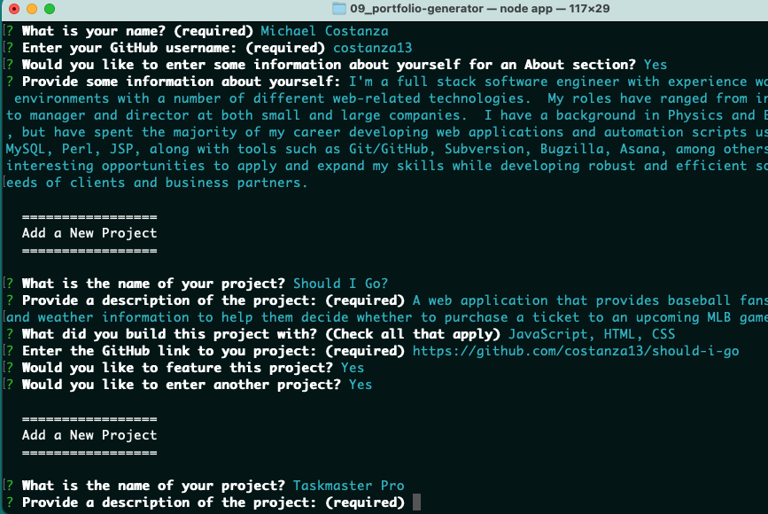
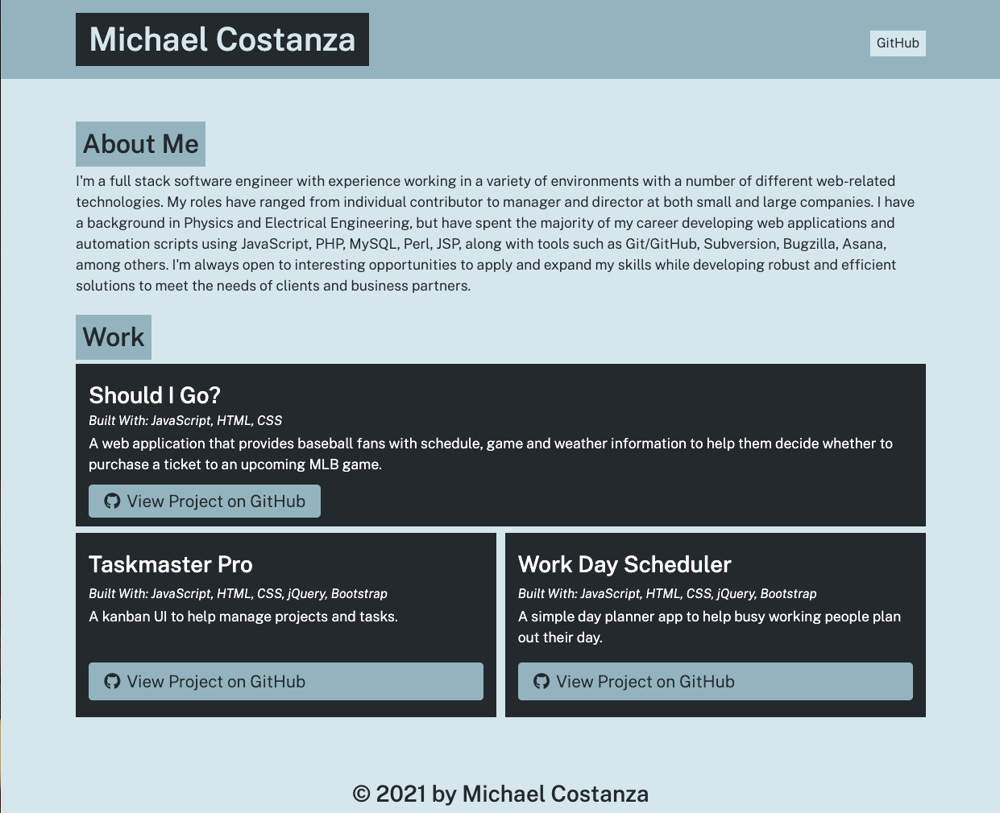

# Portfolio Generator

## Description

A command-line application to automate the process of building a portfolio page based on user input. The application prompts the user for key professional and project information, formats the data and generates and HTML document, which can then be published to the location of the user's choice.

## Languages/Packages Used

The application is built on Node.js and employs the [Inqurirer](https://www.npmjs.com/package/inquirer) package to poewr the commend-line prompts.  A default CSS stylesheet is also provided with the generated HTML file.

## Usage

Clone the repository, then execute the command `node app` in the project's root directory and follow the prompts presented. Upon completion, an `index.html` and a `style.css` file will be written to the `dist` directory. To publish your portfolio, upload those files together, in the same directory, to the web server of your choice.

## Screenshots

  

